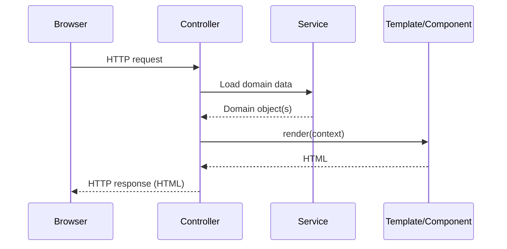
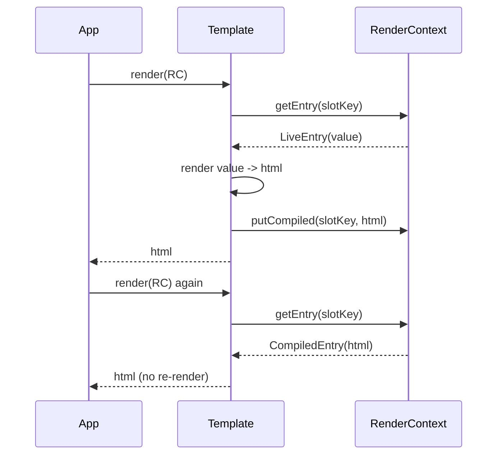
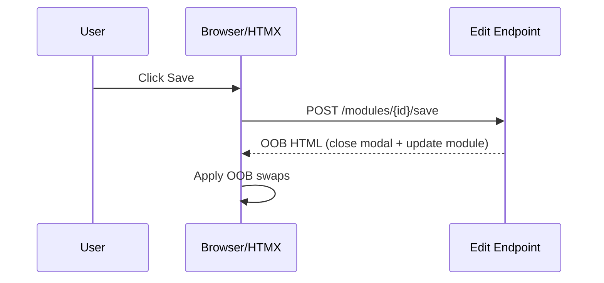

[Previous](03-template-rendercontext-slotkey-reference.md) | [Index](../INDEX.md)

# Rendering Pipeline: High and Low Level

This page explains how SimplyPages turns Java objects into HTML.

## High-Level Pipeline

1. Controller receives request.
2. Service loads domain data.
3. Controller maps data to `RenderContext`.
4. `Template` or `Component` renders HTML.
5. Response returns full page or fragment.

## Low-Level: Template Compilation

`Template.of(root)` compiles a component tree into segments:

- Static string segments
- Dynamic slot segments (`SlotKey` lookups)
- Opaque component segments (fallback component rendering)

Modules are built before compilation (`module.build()`).

## Low-Level: Slot Resolution

During `template.render(context)`:

1. For each segment, renderer appends output to a single `StringBuilder`.
2. For a slot segment:
- if entry is compiled, append compiled HTML
- if entry is live, render value now
- if key missing, evaluate slot default provider
3. Text values are escaped; component values render as nested components.

## Compile-On-First-Hit Behavior

With `RenderPolicy.COMPILE_ON_FIRST_HIT`, explicit live slot entries can be persisted as compiled entries in that context object.

## Escaping Model

- `withInnerText(...)` escapes text.
- `Slot` text values are escaped.
- `withUnsafeHtml(...)` bypasses escaping and must only receive trusted content.

## HTMX Edit OOB Flow

## Practical Debug Checklist

1. Wrong value: verify `SlotKey` names and context keys match.
2. Stale value: check context reuse and compile policy.
3. Escaping surprises: confirm `withInnerText` vs `withUnsafeHtml` usage.
4. Missing module content: verify lifecycle assumptions around `buildContent()`.
